# 单文件上传（UPLOAD_SINGLE）数据流图

> 场景：FTP 单文件 → 单表批量插入

## PlantUML 总图

```plantuml
@startuml
skinparam defaultFontName Microsoft YaHei
skinparam packageStyle rectangle
skinparam package {
  Padding 20
  Margin 10
}

title 单文件上传数据流图（UPLOAD_SINGLE）

top to bottom direction

' ===== 入口层 =====
package "TransferService（入口路由）" as TS {
  left to right direction
  component process as ENTRY
  database 指令表 as CMD_DB
  component "markErrorWithResult\n'Command disappeared'" as CMD_LOST
  component markStartTimeIfAbsent as MARK_START
  component "tempConfigFactory.build" as TEMP_BUILD
  component "configLoader.getConfigOrDefault" as CONFIG_LOAD
  component "markErrorWithResult\n'Config not found'" as CONFIG_LOST
  database 传输配置表 as CFG_DB

  ENTRY -right-> CMD_DB : findById
  CMD_DB --> ENTRY : Command / null
  ENTRY --> CMD_LOST : null
  ENTRY --> MARK_START : Command存在
  MARK_START --> ENTRY
  ENTRY --> TEMP_BUILD : 是TEMPORARY
  ENTRY --> CONFIG_LOAD : 否(非TEMPORARY)
  TEMP_BUILD --> ENTRY : config
  CONFIG_LOAD --> ENTRY : config
  CONFIG_LOAD -up-> CFG_DB : 读配置
  ENTRY --> CONFIG_LOST : config==null
}

component "transferOrchestrator.execute" as PROCESS_NEXT
ENTRY --> PROCESS_NEXT : config存在

' ===== 编排骨架 =====
package "AbstractTransferOrchestrator（编排骨架）" as EXEC {
  left to right direction
  component execute as EXECUTE
  component "newResult\n建Result·设方向·markStart" as NEW_RES
  component dispatch as DISPATCH
  component "catch Exception\nresult.failWith(e)" as CATCH
  component "finalize\n反查elapsed→\n写指令表→写结果表" as FINALIZE
  component startChildMonitorIfNeeded as CHILD_MON
  database 结果表 as RES_DB

  PROCESS_NEXT --> EXECUTE
  EXECUTE --> NEW_RES
  NEW_RES --> DISPATCH
  DISPATCH --> FINALIZE : 正常返回
  DISPATCH --> CATCH : 异常
  CATCH --> FINALIZE
  FINALIZE --> CHILD_MON
  FINALIZE -right-> RES_DB : UPDATE指令表\nINSERT结果表
  CHILD_MON --> EXECUTE
}

' ===== 路由分发 =====
package "TransferOrchestrator.dispatch" as RT {
  component "UPLOAD_SINGLE→\nsingleUpload.handle" as ROUTE
  DISPATCH --> ROUTE
}

' ===== 核心处理 =====
package "SingleUploadHandler.handle" as MAIN {
  left to right direction

  package "Phase1 前置检查" as P1 {
    component "resolveFilePath" as P1_PATH
    component "executeWithClient\n→ preCheck" as P1_CHECK
    component "false → SKIPPED\nreturn" as P1_FAIL
    P1_PATH --> P1_CHECK
    P1_CHECK --> P1_FAIL : false
  }
  note right of P1_FAIL : #1

  package "Phase2 审计与插入" as P2 {
    component "converterFactory.get" as P2_GET
    component "preAudit\ncountRecords" as P2_AUDIT
    component "< 0 → ERROR\nmoveToErrorDir\nreturn" as P2_AUDIT_FAIL
    component "readAndInsert" as P2_READ
    component "流式插入:\n├ buildForUpload\n├ parse\n├ truncateFirst?\n├ batchInsert\n├ handleEmptyData\n└ postAudit" as P2_INSERT
    component "后审计否+非ERROR\n→ moveToErrorDir\nreturn -1" as POST_FAIL_KEEP
    component "后审计通过\nreturn count" as POST_PASS

    P2_GET --> P2_AUDIT
    P2_AUDIT --> P2_AUDIT_FAIL : < 0
    P2_AUDIT --> P2_READ : 通过
    P2_READ --> P2_INSERT
    P2_INSERT --> POST_FAIL_KEEP : 后审计否+非ERROR
    P2_INSERT --> POST_PASS : 后审计通过
    P2_INSERT --> POST_PASS : 后审计否+ERROR\n(抛异常→CATCH)
  }
  note right of P2_AUDIT_FAIL : #3
  note right of P2_INSERT : #4(清表)/#5(追加)\n#6~7(空数据)
  note right of POST_FAIL_KEEP : #9

  package "Phase3 后置处理" as P3 {
    component "executeWithClient\n→ postProcess" as P3_POST
    component "成功 → SUCCESS" as P3_OK
    component "异常 → ERROR\n数据已入库但后置失败" as P3_FAIL
    P3_POST --> P3_OK : 成功
    P3_POST --> P3_FAIL : 异常
  }
  note right of P3_FAIL : #11

  ROUTE --> P1_PATH
  P1_CHECK --> P2_GET : true
  POST_FAIL_KEEP --> P3_FAIL : return -1
  POST_PASS --> P3_POST : recordCount>=0
}

@enduml
```



## 分支场景速览

```plantuml
@startuml
skinparam defaultFontName Microsoft YaHei
title 分支场景速览

package "终态 = SKIPPED (跳过)" #FFF9C4 {
  component "#1 前置检查不通过" as S1
}

package "终态 = SUCCESS (成功)" #C8E6C9 {
  component "#4 清表+插入成功" as S4
  component "#5 追加+插入成功" as S5
  component "#7 空数据+ALLOW/SEND_EMPTY" as S7
  component "#10 全部成功" as S10
}

package "终态 = ERROR (失败)" #FFCDD2 {
  component "#2 前置检查抛异常" as S2
  component "#3 预审计不通过" as S3
  component "#6 空数据+ERROR/SKIP" as S6
  component "#8 后审计失败+ERROR模式(回滚)" as S8
  component "#9 后审计失败+非ERROR模式(保留)" as S9
  component "#11 数据成功+后置处理失败" as S11
  component "#12 配置缺失" as S12
  component "#13 命令消失" as S13
}

note bottom of S1
  #1: 前置文件不存在或FLAG比对false
  → result=SKIPPED, 不走任何数据操作
endnote

note bottom of S4
  #4: 清表后事务内插入成功
endnote

note bottom of S5
  #5: 追加数据插入成功
endnote

note bottom of S7
  #7: 空数据被允许, 0条正常写入
endnote

note bottom of S10
  #10: 全链路通过
endnote

note bottom of S2
  #2: FlagCheckException上抛
endnote

note bottom of S3
  #3: 文件记录数不等于预期稽核数,移入错误目录
endnote

note bottom of S6
  #6: 空数据引发抛异常,事务回滚
endnote

note bottom of S8
  #8: 后审计否引发抛异常,事务回滚(数据撤销)
endnote

note bottom of S9
  #9: 后审计否,数据已提交但标记ERROR(文件移错)
endnote

note bottom of S11
  #11: 数据入库但后置FB/SUB/REN等失败
endnote

note bottom of S12
  #12: 配置表中无对应记录
endnote

note bottom of S13
  #13: 指令被删除/未查到
endnote

@enduml
```



## 场景表

| # | 场景 | 触发条件 | 终态 | 数据是否入库 | 文件是否移动 |
|---|------|----------|------|-------------|-------------|
| 1 | 前置检查不通过 | `preCheck` 返回 `false`（文件不存在/FLAG比对失败） | **SKIPPED** | 否 | 否 |
| 2 | 前置检查抛异常 | `preCheck` 抛出异常（如 FLAG 模式码异常） | **ERROR** | 否 | 否 |
| 3 | 预审计不通过 | `preAudit < 0`（文件记录数 ≠ `auditCount`） | **ERROR** | 否 | 是（→错误目录） |
| 4 | 清表模式+插入成功 | `clearTableFlag=Y` + 全部成功 | **SUCCESS** | 是（先TRUNCATE再INSERT） | 否 |
| 5 | 追加模式+插入成功 | `clearTableFlag≠Y` + 全部成功 | **SUCCESS** | 是（追加） | 否 |
| 6 | 空数据 ERROR/SKIP | 0 条记录 + `emptyDataHandling=ERROR/SKIP` | **ERROR** | 否（事务回滚） | 否 |
| 7 | 空数据 ALLOW/SEND_EMPTY | 0 条记录 + `emptyDataHandling=ALLOW/SEND_EMPTY` | **SUCCESS** | 是（0条写入） | 否 |
| 8 | 后审计失败+ERROR模式 | `fileRecordCount≠inserted` + `emptyDataHandling=ERROR` | **ERROR** | 否（事务回滚） | 否 |
| 9 | 后审计失败+非ERROR模式 | `fileRecordCount≠inserted` + `emptyDataHandling≠ERROR` | **ERROR** | **是（已提交）** | 是（→错误目录） |
| 10 | 全部成功 | preCheck → preAudit → insert → postAudit → postProcess 全通过 | **SUCCESS** | 是 | 否 |
| 11 | 数据成功+后置处理失败 | 入库成功但 postProcess 异常 | **ERROR** | **是（已提交）** | 否 |
| 12 | 配置缺失 | `getConfigOrDefault` 未找到 或 `tempConfigFactory.build` 失败 | **ERROR** | 否（未到 Handler） | 否 |
| 13 | 命令消失 | `findById` 返回 null（卡P兜底） | **ERROR** | 否（未到 Handler） | 否 |

## 关键设计要点

### FTP 连接生命周期（3~4 次独立借还）

| 阶段 | 借还次数 | 调用链 |
|------|---------|--------|
| Phase 1 preCheck | 1 | `executeWithClient → preCheck(client, config, fileInfo) → 释放` |
| Phase 2 preAudit | 1 | `ftpPool.withClient → countRecords(is) → 释放`（隐式） |
| Phase 2 readAndInsert | 1 | `executeWithClient → getInputStream → parse → insert → 释放` |
| Phase 3 postProcess | 1 | `executeWithClient → postProcess(client, config, fileInfo) → 释放` |

### 事务边界

```
┌─ TransactionTemplate (一次事务) ─────────────────────────┐
│  1. [可选] TRUNCATE 目标表 (clearTableFlag=Y)            │
│  2. 流式解析文件(batchSize=1000), 逐批INSERT             │
│  3. handleEmptyData(totalRecords, emptyDataHandling)     │
│     → 0条+ERROR/SKIP → 抛异常(RuntimeException)         │
│  4. postAudit(fileRecordCount, inserted)                 │
│     → 不匹配+ERROR模式 → 抛异常(RuntimeException)        │
└──────────────────────────────────────────────────────────┘
  ✓ 整个事务回滚: TRUNCATE也回滚(旧数据恢复)
  ✓ 全部成功: 事务提交
```

### 异常链传递

```
dispatch()失败(含preCheck抛异常)
  → catch(Exception) → result.failWith(e) → finalize
    → UPDATE 指令表 set STATUS=ERROR + INSERT 结果表

insertAndVerifyInTx内抛异常(空数据/后审计ERROR)
  → readAndInsert内 resolve → 上抛到 dispatch
  → catch(Exception) → result.failWith(e) → finalize
    → 事务已回滚 + 指令表/结果表写ERROR

postProcess失败
  → 不抛异常, 直接setOutcome(recordCount, ERROR, msg) + return
  → finalize写入ERROR状态
```
